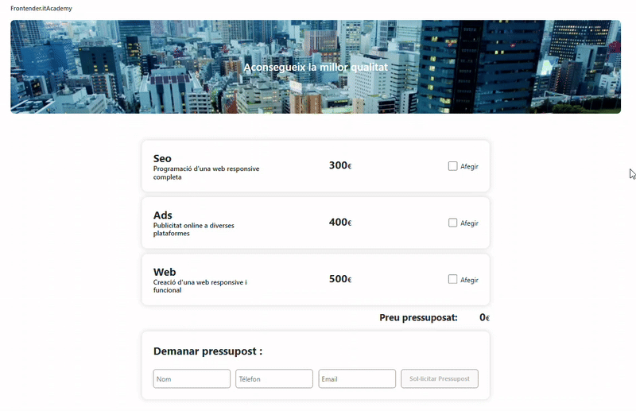
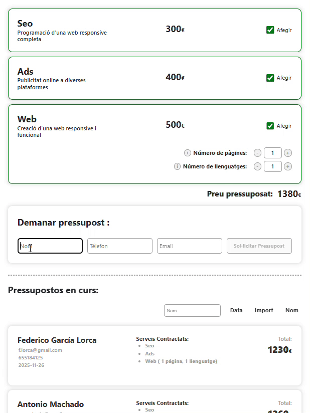
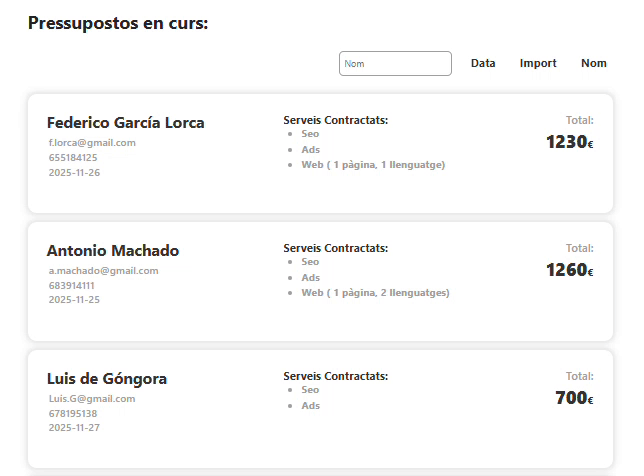
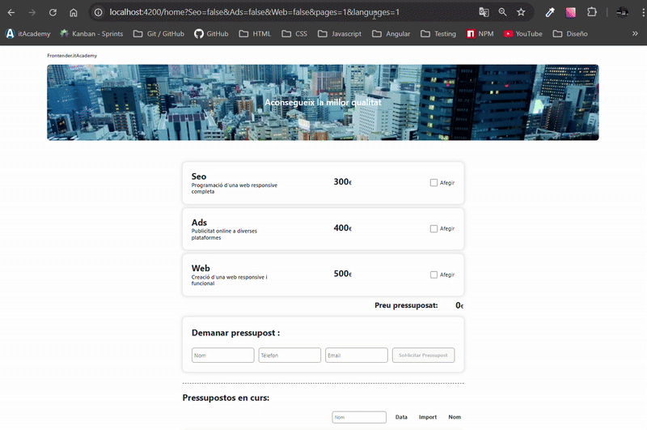

# Sprint 6 - WebBudget form 


## Index

- [Descripción de la Aplicación](#descripción-de-la-aplicación)
- [Tecnologías](#tecnologías)
- [Estructura del Proyecto](#estructura-del-proyecto)
- [Instalación del Proyecto](#instalación-del-proyecto)
- [Uso](#uso)
- [Vista Previa del Proyecto](#vista-previa-del-proyecto)
- [Tests](#tests)
- [Contribución](#Contribución)
- [GH-Pages](#gh-pages)
- [Autor](#autor)

---

## Descripción de la Aplicación:

Este proyecto consiste en una aplicación Angular diseñada para calcular presupuestos web de forma dinámica. El usuario puede seleccionar servicios, ajustar parámetros específicos, generar varios presupuestos, ordenarlos y filtrarlos, e incluso compartirlos mediante una URL personalizada.

La aplicación está dividida en componentes independientes (`standalone`) que se comunican entre sí mediante Eventos, Services y Signals, e incorpora formularios reactivos, validaciones, gestión y filtrado de datos, y un modal generado con ayuda de `Bootstrap 5`.

La funcionalidad se ha construido por niveles:
- Cálculo reactivo del presupuesto
- Popup de ayuda con Bootstrap Modal
- Gestión de múltiples presupuestos
- Ordenación y filtrado
- Compartición de presupuestos vía URL generada dinámicamente

---

## Tecnologías

- `HTML`
- `CSS` / `Bootstrap 5`
- `TypeScript`
- `Angular 20 `
- Testing con `Jasmine` / `Karma`

---

## Estructura del Proyecto

```bash
src/
 └─ app/
     ├─ components/
     │   ├─ budget/
     │   │   ├─ budgets-list/
     │   │   ├─ budget-list-toolbar/
     │   │   └─ budget-item/
     │   ├─ form/
     │   │   ├─ form-main/
     │   │   ├─ option-form/
     │   │   ├─ contact-form/
     │   │   ├─ panel/
     │   │   └─ modal/
     │   ├─ home/
     │   └─ welcome/
     ├─ header/
     ├─ models/
     │   └─ budget-item.model.ts
     └─ services/
         └─ budget.ts
```

---

## Instalación del proyecto

#### Requisitos previos
- Antes de instalar el proyecto asegúrate de tener:
    - node < 22
    - npm < 10
    - Angular CLI (instalado globalmente)
    - Navegador web

1. Clona el repositorio:

```bash
    git clone https://github.com/JordiMiravet/Bootcamp-S6.git
```

2. Instala dependencias:

```bash
    npm install
```

3. Ejecuta el servidor:

```bash
    ng serve
```

4. Abrir en el navegador:

```bash
    http://localhost:4200
```

---

## Uso

Tras iniciar la aplicación, el usuario puede:

1. **Seleccionar servicios** y configurar parámetros para calcular el presupuesto en tiempo real.
2. **Abrir el modal de ayuda** para ver información sobre cada opción disponible.
3. **Rellenar sus datos personales** mediante formularios reactivos con validación.
4. **Generar y guardar varios presupuestos** desde la lista.
5. **Ordenar y filtrar la lista** por nombre, fecha o importe total.
6. **Compartir un presupuesto** mediante una URL generada automáticamente.

---

## Vista Previa del proyecto

1. Selección de servicios y cálculo



2. Modal de ayuda


3. Datos del usuario



4. Listado ordenable 
- Mediante input : 
    - Para filtrar por nombre
- Mediante botones:
    - 'Data' : Para ordenar por calendario, 
    - 'Import' : Para ordenar por importe total (€)
    - 'Nombre' : Para ordenar por nombre



5. URL compartible



---

## Tests

La aplicación incluye pruebas unitarias con `Jasmine` y se ejecutan mediante `Karma`.  

#### Resumen
- `40 specs` ejecutadas
- `0 fallos`
- Componentes principales testeados:
  - `BudgetItemComponent`
  - `BudgetListToolbarComponent`
  - `PanelComponent`
  - `FormMainComponent`
  - `OptionForm`
  - `HomeComponent`
  - `BudgetsList`
  - `ContactFormComponent`
  - `ModalComponent`

#### Ejemplo destacado

Se verifica que el cálculo del presupuesto se actualice de forma reactiva al seleccionar opciones en `FormMainComponent`:

```ts
it('should calculate total price reactive to selected options', () => {
    component.seoControl.setValue(true);
    component.adsControl.setValue(true);
    component.webControl.setValue(true);

    const expectedTotal = 
        component.budgetService.seoBasePrice + 
        component.budgetService.adsBasePrice + 
        component.budgetService.calculateTotalWeb(component.pages(), component.languages())

    expect(component.result()).toEqual(expectedTotal);
});
```

#### Ejecutar test

- Para correr todos los tests locales:

```bash
    ng test
```

---

## Contribución
 
Para colaborar en este proyecto, sigue estos pasos:

1. Haz un **fork** del repositorio.

```bash
https://github.com/JordiMiravet/Bootcamp-S6.git
```

2. Crea una nueva rama para tu funcionalidad o corrección:

```bash
   git checkout -b feature/nueva-funcionalidad

```

3. Realiza los cambios y asegúrate de que los test pasan correctamente.

4. Haz un commit siguiendo las Conventional Commits:

```bash
    feat: añade nuevo cálculo de presupuesto
    fix: corrige error en el formulario de usuario
    docs: actualiza documentación del modal de ayuda
```

5. Envía un Pull Request describiendo tus cambios.

---

## GH-Pages
// Ahora cuando lo acabe lo pongo este tambien

---

## Autor

```bash
    Jordi Miravet – Bootcamp S6 : WebBudget App
```